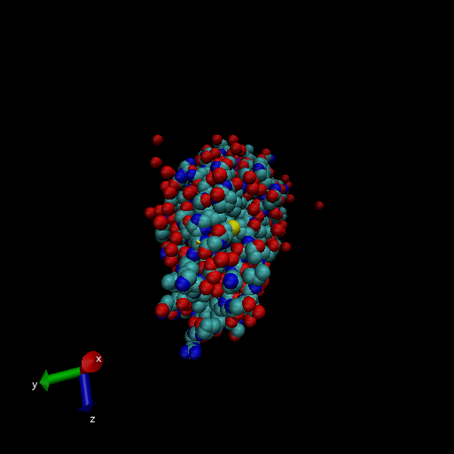

```{r}
db <- read.csv("Data Export Summary.csv",row.names=1)
head(db)
```

> Q1: What percentage of structures in the PDB are solved by X-Ray and Electron Microscopy.

```{r}
method.sums <- colSums(db)
method.sums
method.sums/method.sums["Total"]
```

X-Ray = 87.6%, EM = 4.92%

> Q2: What proportion of structures in the PDB are protein?

STILL NEED TO ANSWER

```{r}
column.sums <- rowSums(db)
column.sums
column.sums/method.sums["Total"]
```

> Q3: Type HIV in the PDB website search box on the home page and determine how many HIV-1 protease structures are in the current PDB?

STILL NEED TO ANSWER

> Q4: Water molecules normally have 3 atoms. Why do we see just one atom per water molecule in this structure?

We just see the oxygen atom in the water molecule because the hydrogen atom is smaller than the smallest representation VMD can provide.

> Q5: There is a conserved water molecule in the binding site. Can you identify this water molecule? What residue number does this water molecule have (see note below)?

## VMD structure visualization image



