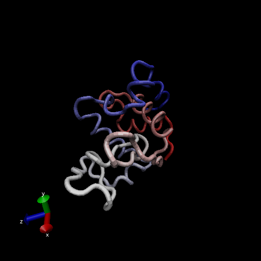
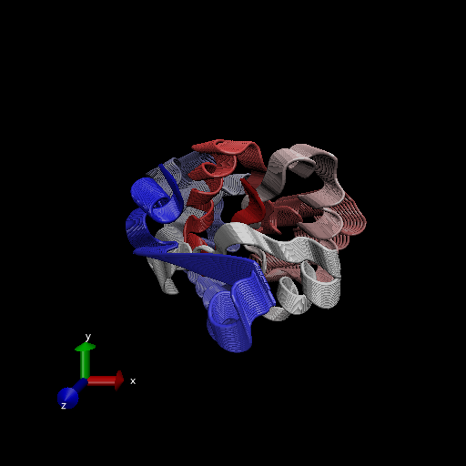
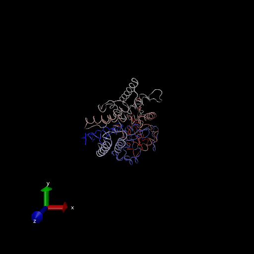

# Introduction to Bio3D in R

```{r}
# load the library
library(bio3d)

pdb <- read.pdb("1hsg")
pdb
```
```{r}
aa123(pdbseq(pdb))
```
```{r}
# ATOM records
head(pdb$atom)
```
> Q7: How many amino acid residues are there in this pdb object?

198

> Q8: Name one of the two non-protein residues?
 
 HOH
 
 > Q9: How many protein chains are in this structure?
 
 2
 
# Comparative Analysis of Protein Structures
```{r}
library(bio3d)

pdb <- read.pdb("1hel")
pdb
```

Let's use bioinformatics methods called NMA (Normal Mode Analysis) to predict the dynamics (flexibility) of the enzyme

```{r}
modes <- nma(pdb)
plot(modes)
```

Make a "move" of its predicted motion. We often call this a "trajectory"

```{r}
mktrj(modes, file="nma.pdb")
```
Upload image of nma.pdb

# Analysis of ADK

> Q10. Which of the packages above is found only on BioConductor and not CRAN?

"msa"

> Q11. Which of the above packages is not found on BioConductor or CRAN?

The packages that are downloaded from GitHub or Bitbucket are not on Bioconductor or CRAN. In this case it is "Grantlab/bio3d-view" from bitbucket

> Q12. True or False? Functions from the devtools package can be used to install packages from GitHub and BitBucket?

TRUE

Search and Retreive ADK structures
```{r}
aa <- get.seq("1ake_A")

```

> Q13. How many amino acids are in this sequence, i.e. how long is this sequence?

214

```{r}
# List out some 'top hits'
hits <- NULL
hits$pdb.id <- c('1AKE_A','4X8M_A','6S36_A','6RZE_A','4X8H_A','3HPR_A','1E4V_A','5EJE_A','1E4Y_A','3X2S_A','6HAP_A','6HAM_A','4K46_A','4NP6_A','3GMT_A','4PZL_A')
```

```{r}
# Download releated PDB files
files <- get.pdb(hits$pdb.id, path="pdbs", split=TRUE, gzip=TRUE)
```

Multiple Structure Alignment
```{r}
# Align releated PDBs
pdbs <- pdbaln(files, fit = TRUE, exefile="./muscle")
```
```{r}
# Vector containing PDB codes for figure axis
ids <- basename.pdb(pdbs$id)
# Draw schematic alignment
plot(pdbs, labels=ids)
```

Use bio3d pca() function 
```{r}
# Perform PCA
pc.xray <- pca(pdbs)
plot(pc.xray)
```
```{r}
# Calculate RMSD
rd <- rmsd(pdbs)
# Structure-based clustering
hc.rd <- hclust(dist(rd))
grps.rd <- cutree(hc.rd, k=3)

plot(pc.xray, 1:2, col="grey50", bg=grps.rd, pch=21, cex=1)
```


```{r}
# Visualize first principal component
pc1 <- mktrj(pc.xray, pc=1, file="pc_1.pdb")
```



# Find a gene VMD file:CATF845.fwd CATF



