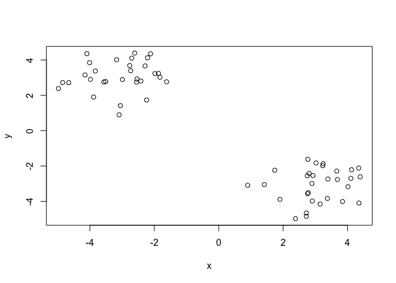
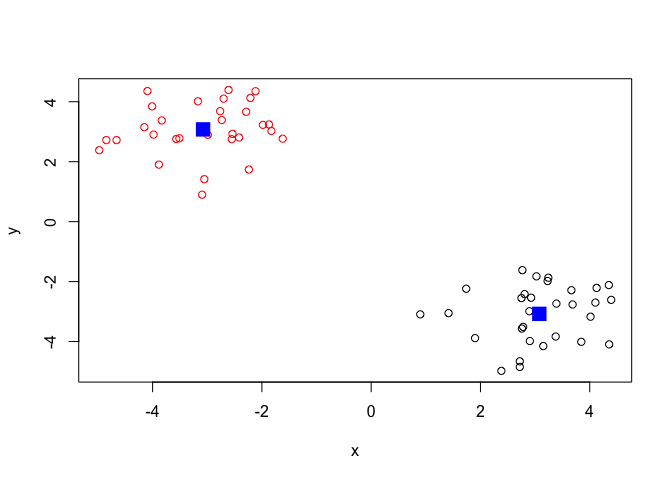
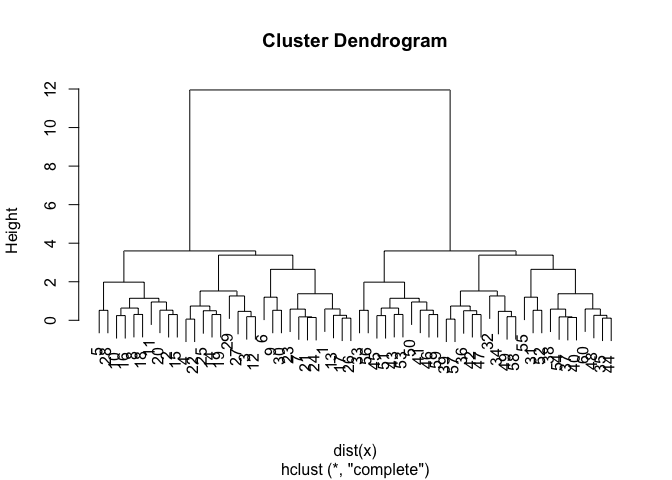
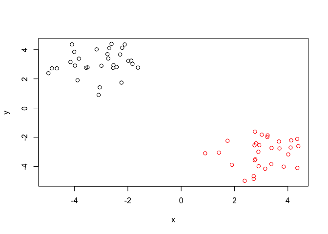
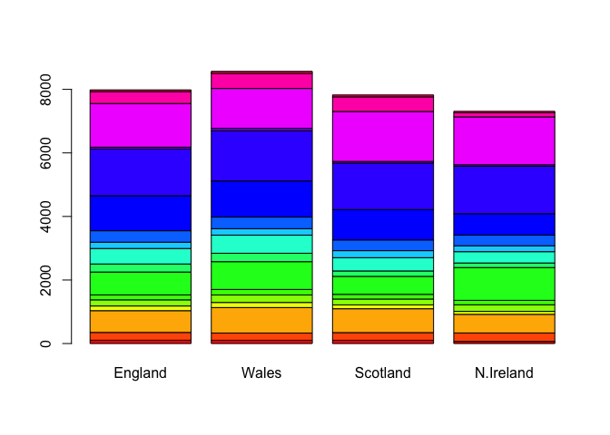
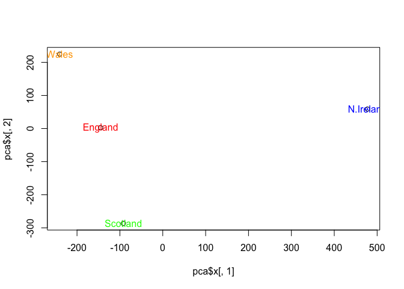

Class\_08
================
Anika Bhattacharjya (A15459876)
10/21/2021

First up is clustering methods

\#Kmeans clustering

The function in base R to do Kmeans clustering is called ‘kmeans()’

First make up some data where we know what the answer should be:

``` r
tmp <- c(rnorm(30,-3), rnorm(30,3))
x <- cbind(x=tmp, y=rev(tmp))
x
```

    ##                x          y
    ##  [1,] -1.6189250  2.7671055
    ##  [2,] -2.7641021  3.6862728
    ##  [3,] -4.6599242  2.7195177
    ##  [4,] -3.5101563  2.7812706
    ##  [5,] -4.0948340  4.3557564
    ##  [6,] -2.2382908  1.7391751
    ##  [7,] -2.5387188  2.9278093
    ##  [8,] -2.6100513  4.3928532
    ##  [9,] -3.0535560  1.4158803
    ## [10,] -2.2106579  4.1261961
    ## [11,] -3.1709504  4.0146853
    ## [12,] -4.8473583  2.7198572
    ## [13,] -1.8255363  3.0249150
    ## [14,] -3.9826408  2.9041840
    ## [15,] -2.7341266  3.3901502
    ## [16,] -2.1160710  4.3496591
    ## [17,] -1.9816148  3.2293275
    ## [18,] -2.7004280  4.1035286
    ## [19,] -4.1513625  3.1502914
    ## [20,] -2.2880857  3.6641670
    ## [21,] -2.5507840  2.7505983
    ## [22,] -3.5669330  2.7584512
    ## [23,] -2.9897965  2.8952056
    ## [24,] -2.4166127  2.8075303
    ## [25,] -3.8329829  3.3764498
    ## [26,] -1.8704176  3.2419657
    ## [27,] -4.9775217  2.3828764
    ## [28,] -4.0091513  3.8456365
    ## [29,] -3.8853651  1.9014674
    ## [30,] -3.0932256  0.8988587
    ## [31,]  0.8988587 -3.0932256
    ## [32,]  1.9014674 -3.8853651
    ## [33,]  3.8456365 -4.0091513
    ## [34,]  2.3828764 -4.9775217
    ## [35,]  3.2419657 -1.8704176
    ## [36,]  3.3764498 -3.8329829
    ## [37,]  2.8075303 -2.4166127
    ## [38,]  2.8952056 -2.9897965
    ## [39,]  2.7584512 -3.5669330
    ## [40,]  2.7505983 -2.5507840
    ## [41,]  3.6641670 -2.2880857
    ## [42,]  3.1502914 -4.1513625
    ## [43,]  4.1035286 -2.7004280
    ## [44,]  3.2293275 -1.9816148
    ## [45,]  4.3496591 -2.1160710
    ## [46,]  3.3901502 -2.7341266
    ## [47,]  2.9041840 -3.9826408
    ## [48,]  3.0249150 -1.8255363
    ## [49,]  2.7198572 -4.8473583
    ## [50,]  4.0146853 -3.1709504
    ## [51,]  4.1261961 -2.2106579
    ## [52,]  1.4158803 -3.0535560
    ## [53,]  4.3928532 -2.6100513
    ## [54,]  2.9278093 -2.5387188
    ## [55,]  1.7391751 -2.2382908
    ## [56,]  4.3557564 -4.0948340
    ## [57,]  2.7812706 -3.5101563
    ## [58,]  2.7195177 -4.6599242
    ## [59,]  3.6862728 -2.7641021
    ## [60,]  2.7671055 -1.6189250

``` r
plot(x)
```

<!-- -->

> Q. Can we use kmeans to cluster this data setting k 2 and nstart to 20

``` r
km <- kmeans(x, centers=2, nstart=20)
km
```

    ## K-means clustering with 2 clusters of sizes 30, 30
    ## 
    ## Cluster means:
    ##           x         y
    ## 1  3.077388 -3.076339
    ## 2 -3.076339  3.077388
    ## 
    ## Clustering vector:
    ##  [1] 2 2 2 2 2 2 2 2 2 2 2 2 2 2 2 2 2 2 2 2 2 2 2 2 2 2 2 2 2 2 1 1 1 1 1 1 1 1
    ## [39] 1 1 1 1 1 1 1 1 1 1 1 1 1 1 1 1 1 1 1 1 1 1
    ## 
    ## Within cluster sum of squares by cluster:
    ## [1] 47.26157 47.26157
    ##  (between_SS / total_SS =  92.3 %)
    ## 
    ## Available components:
    ## 
    ## [1] "cluster"      "centers"      "totss"        "withinss"     "tot.withinss"
    ## [6] "betweenss"    "size"         "iter"         "ifault"

> Q. How many points are in each cluster?

``` r
km$size
```

    ## [1] 30 30

> Q. What ‘component’ of your result object details cluster
> assignment/membership?

``` r
km$cluster
```

    ##  [1] 2 2 2 2 2 2 2 2 2 2 2 2 2 2 2 2 2 2 2 2 2 2 2 2 2 2 2 2 2 2 1 1 1 1 1 1 1 1
    ## [39] 1 1 1 1 1 1 1 1 1 1 1 1 1 1 1 1 1 1 1 1 1 1

> What ‘component’ of your result object details cluster centers?

``` r
km$centers
```

    ##           x         y
    ## 1  3.077388 -3.076339
    ## 2 -3.076339  3.077388

> Q. Plot x colored by the kmeans cluster assignment and add cluser
> centers as blue points

``` r
plot(x, col= km$cluster)
points(km$centers, col="blue", pch=15, cex=2)
```

<!-- -->

Analyze same data with hclust()

``` r
hc <- hclust (dist(x))
hc
```

    ## 
    ## Call:
    ## hclust(d = dist(x))
    ## 
    ## Cluster method   : complete 
    ## Distance         : euclidean 
    ## Number of objects: 60

There is a plot method for hclust result object

``` r
plot(hc)
```

<!-- -->

To get our cluster membership vector we need to do a little more work.
We have to “cut” the tree where we think it makes sense. For this we use
`cutree()`
    function.

``` r
cutree(hc, h = 6)
```

    ##  [1] 1 1 1 1 1 1 1 1 1 1 1 1 1 1 1 1 1 1 1 1 1 1 1 1 1 1 1 1 1 1 2 2 2 2 2 2 2 2
    ## [39] 2 2 2 2 2 2 2 2 2 2 2 2 2 2 2 2 2 2 2 2 2 2

You can also call `cutree()` setting k = numner of grps/clusters you
want.

``` r
cutree(hc, k=2)
```

    ##  [1] 1 1 1 1 1 1 1 1 1 1 1 1 1 1 1 1 1 1 1 1 1 1 1 1 1 1 1 1 1 1 2 2 2 2 2 2 2 2
    ## [39] 2 2 2 2 2 2 2 2 2 2 2 2 2 2 2 2 2 2 2 2 2 2

Make our results plot

``` r
grps <- cutree(hc,k=2)
plot(x, col=grps)
```

<!-- -->

\#PCA of UK food data

> import data

``` r
url <- "https://tinyurl.com/UK-foods"
x <- read.csv(url)
```

> Q1. How many rows and columns are in your new data frame named x? What
> R functions could you use to answer this questions?

``` r
dim(x)
```

    ## [1] 17  5

> Checking your data

Preview first 6 rows

``` r
x
```

    ##                      X England Wales Scotland N.Ireland
    ## 1               Cheese     105   103      103        66
    ## 2        Carcass_meat      245   227      242       267
    ## 3          Other_meat      685   803      750       586
    ## 4                 Fish     147   160      122        93
    ## 5       Fats_and_oils      193   235      184       209
    ## 6               Sugars     156   175      147       139
    ## 7      Fresh_potatoes      720   874      566      1033
    ## 8           Fresh_Veg      253   265      171       143
    ## 9           Other_Veg      488   570      418       355
    ## 10 Processed_potatoes      198   203      220       187
    ## 11      Processed_Veg      360   365      337       334
    ## 12        Fresh_fruit     1102  1137      957       674
    ## 13            Cereals     1472  1582     1462      1494
    ## 14           Beverages      57    73       53        47
    ## 15        Soft_drinks     1374  1256     1572      1506
    ## 16   Alcoholic_drinks      375   475      458       135
    ## 17      Confectionery       54    64       62        41

Row-names are incorrectly set as the first column of our x data fram.
Use minus indexing as one option.

``` r
rownames(x) <- x[,1]
x <- x[,-1]
head(x)
```

    ##                England Wales Scotland N.Ireland
    ## Cheese             105   103      103        66
    ## Carcass_meat       245   227      242       267
    ## Other_meat         685   803      750       586
    ## Fish               147   160      122        93
    ## Fats_and_oils      193   235      184       209
    ## Sugars             156   175      147       139

There is a problem here because if we keep inputing the function it
takes a column away each time.

Another method:

``` r
x <- read.csv(url, row.names=1)
head (x)
```

    ##                England Wales Scotland N.Ireland
    ## Cheese             105   103      103        66
    ## Carcass_meat       245   227      242       267
    ## Other_meat         685   803      750       586
    ## Fish               147   160      122        93
    ## Fats_and_oils      193   235      184       209
    ## Sugars             156   175      147       139

``` r
dim(x)
```

    ## [1] 17  4

Now we have correct dimensions \> Q2. Which approach to solving the
‘row-names problem’ mentioned above do you prefer and why? Is one
approach more robust than another under certain circumstances?

The second option is the better option because it doesn’t keep taking
away columns.

Plot the data

``` r
barplot(as.matrix(x), beside=T, col=rainbow(nrow(x)))
```

<!-- -->

> Q3: Changing what optional argument in the above barplot() function
> results in the following plot?

Set beside to false

``` r
barplot(as.matrix(x), beside=F, col=rainbow(nrow(x)))
```

<!-- -->

> Q5: Generating all pairwise plots may help somewhat. Can you make
> sense of the following code and resulting figure? What does it mean if
> a given point lies on the diagonal for a given plot?

``` r
pairs(x, col=rainbow(10), pch=16)
```

<!-- -->

> Q6. What is the main differences between N. Ireland and the other
> countries of the UK in terms of this data-set?

Can’t really tell the difference at this point the way the data is
presented.

Use PCA Funtion

``` r
# Use the prcomp() PCA function
pca <- prcomp(t(x))
summary(pca)
```

    ## Importance of components:
    ##                             PC1      PC2      PC3       PC4
    ## Standard deviation     324.1502 212.7478 73.87622 4.189e-14
    ## Proportion of Variance   0.6744   0.2905  0.03503 0.000e+00
    ## Cumulative Proportion    0.6744   0.9650  1.00000 1.000e+00

> Q7. Complete the code below to generate a plot of PC1 vs PC2. The
> second line adds text labels over the data points.

``` r
#Plot PC1 vs PC2
colors <- c("red", "Orange", "Green", "Blue")
plot(pca$x[,1], pca$x[,2])
text(pca$x[,1], pca$x[,2], colnames(x), col= colors)
```

<!-- -->

Variable Loadings\!

``` r
# Focus on PC1 as it accounts for > 90% of variance
par(mar=c(10, 3, 0.35, 0))
barplot(pca$rotation[,1], las=2)
```

<!-- -->
