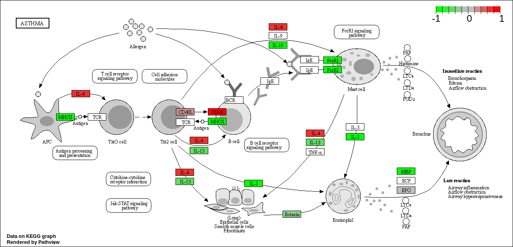

# Bioconductor and DESeq2 setup

```{r}
#install.packages("BiocManager")
#BiocManager::install()
#BiocManager::install("DESeq2")
```

```{r}
library(BiocManager)
library(DESeq2)
```
# Import countData and colData

```{r}
counts <- read.csv("airway_scaledcounts.csv", row.names=1)
metadata <-  read.csv("airway_metadata.csv")
```
```{r}
head(counts)
```
```{r}
head(metadata)
```
> Q1. How many genes are in this dataset? 

```{r}
nrow(counts)
```

38694 genes

> Q2. How many ‘control’ cell lines do we have?

```{r}
sum(metadata$dex == "control")
```
4 control cell lines

# Toy differential gene expression

Need to extract all the 'control' columns before taking the row-wise mean to get the average count values for all genes in these 4 experiments:
```{r}
control <- metadata[metadata[,"dex"]=="control",]
control.counts <- counts[ ,control$id]
control.mean <- rowMeans(control.counts) 
head(control.mean)
```
> Q3. How would you make the above code in either approach more robust?

Get rid of the '/4' and just take rowMeans because the number of data points will change over time and may not always be 4. In class we used rowMeans already so I never used the "control.mean <- rowSums(control.counts)/4" code.


> Q4. Follow the same procedure for the treated samples (i.e. calculate the mean per gene across drug treated samples and assign to a labeled vector called treated.mean)

Finding 'treated' mean:
```{r}
treated <- metadata[metadata[,"dex"]=="treated",]
treated.counts <-counts[ ,treated$id]
treated.mean <-rowMeans(treated.counts) 
head(treated.mean)
```
Combine meancount data for bookkeeping purposes
```{r}
meancounts <- data.frame(control.mean, treated.mean)

# Sum of mean for all counts
colSums(meancounts)
```

> Q5 (a). Create a scatter plot showing the mean of the treated samples against the mean of the control samples.

```{r}
plot(meancounts)
```

> Q5 (b).You could also use the ggplot2 package to make this figure producing the plot below. What geom_?() function would you use for this plot? 

You would use geom_point.

> Q6. Try plotting both axes on a log scale. What is the argument to plot() that allows you to do this?

```{r}
plot(meancounts, log="xy")
```

We often use log2 in this field because it has nice math properties that make interpretation more straightforward.

```{r}
log2(40/10)
```
```{r}
log2(10/10)
```

```{r}
log2(5/10)
```

We see 0 values for no change, positive values for increases and negative values for decreases. This nice property leads us to work with **log2(fold-change)** in genomics and proteomics.

Let's add **log2(fold-change)** values to `meancounts`

```{r}
meancounts$log2fc <- log2(meancounts[,"treated.mean"]/meancounts[,"control.mean"])
head(meancounts)
```
The NaN result happens when you divide by zero and try to take the log. The -Inf result is given when you try to take the log of zero. 

We need to exclude the genes with zero counts because we can't say anything about them.
```{r}
#meancounts[,1:2] == 0

zero.vals <- which(meancounts[,1:2]==0, arr.ind=TRUE)
```
```{r}
head(zero.vals)
```
```{r}
to.rm <- unique(zero.vals[,"row"])
```
```{r}
mycounts <- meancounts[-to.rm,]
head(sort(to.rm))
```
```{r}
head(mycounts)
```
```{r}
# How many genes are left?
nrow(mycounts)
```

> Q7. What is the purpose of the arr.ind argument in the which() function call above? Why would we then take the first column of the output and need to call the unique() function?

`array.inds` tells you which values are returned when the variable equals an specific array, in this case which values are TRUE. `unique` makes sure we don't count any values twice.

> Q8.Using the up.ind vector above can you determine how many up regulated genes we have at the greater than 2 fc level?

```{r}
up.ind <- mycounts$log2fc > 2
which(up.ind, arr.ind = TRUE)

```

250 genes

> Q9. Using the down.ind vector above can you determine how many down regulated genes we have at the greater than 2 fc level? 

```{r}
down.ind <- mycounts$log2fc < (-2)
which(down.ind, arr.ind = TRUE)
```

367 genes

> Q10. Do you trust these results? Why or why not?

Not really because fold change could be large without being significant. We need to normalize our data first before we can see any real trends.

# DESeq2 analysis

```{r}
library(DESeq2)
```
```{r}
citation("DESeq2")
```
```{r}
dds <- DESeqDataSetFromMatrix(countData=counts, 
                              colData=metadata, 
                              design=~dex)
```
```{r}
dds
```
Getting results:
```{r}
dds <- DESeq(dds)
```
```{r}
res <- results(dds)
res
```
Summarize results
```{r}
summary(res)
```
Customize results table
Focus in on genes with a small p-value (significant change)
```{r}
res05 <- results(dds, alpha=0.05)
summary(res05)
```
# Save our results
Write out whole results data set (including genes that don't change significantly)
```{r}
write.csv(res, file="allmyresults.csv")
```

# Data Visualization
Volcano plots

```{r}
plot( res$log2FoldChange,  -log(res$padj), 
      xlab="Log2(FoldChange)",
      ylab="-Log(P-value)")
```

Make the plots more useful
```{r}
plot( res$log2FoldChange,  -log(res$padj), 
 ylab="-Log(P-value)", xlab="Log2(FoldChange)")

# Add some cut-off lines
abline(v=c(-2,2), col="darkgray", lty=2)
abline(h=-log(0.05), col="darkgray", lty=2)
```

Set up custom color vector
```{r}
# Setup our custom point color vector 
mycols <- rep("gray", nrow(res))
mycols[ abs(res$log2FoldChange) > 2 ]  <- "red" 

inds <- (res$padj < 0.01) & (abs(res$log2FoldChange) > 2 )
mycols[ inds ] <- "blue"

# Volcano plot with custom colors 
plot( res$log2FoldChange,  -log(res$padj), 
 col=mycols, ylab="-Log(P-value)", xlab="Log2(FoldChange)" )

# Cut-off lines
abline(v=c(-2,2), col="gray", lty=2)
abline(h=-log(0.1), col="gray", lty=2)
```

# Add Annotation data

We need two bioconductor packages
```{r}
library("AnnotationDbi")
library("org.Hs.eg.db")
```
```{r}
columns(org.Hs.eg.db)
```
We will use `mapIDs` function to translate between identifiers from different data bases
```{r}
res$symbol <- mapIds(org.Hs.eg.db,
                     keys=row.names(res), # Our gene names
                     keytype="ENSEMBL",        # The format of our gene names
                     column="SYMBOL",          # The new format we want to add
                     multiVals="first")
```
```{r}
head(res)
```

# Enhanced Volcano Plots

Download didn't work, Professor Grant said to skip this section.

# Pathway Analysis
```{r}
library(pathview)
library(gage)
library(gageData)

```
```{r}
res$entrez <- mapIds(org.Hs.eg.db,
                     keys=row.names(res), 
                     keytype="ENSEMBL",        
                     column="ENTREZID",          
                     multiVals="first")
```
```{r}
head(res)
```
Load Kegg data set
```{r}
data(kegg.sets.hs)
```
```{r}
# Examine the first 2 pathways in this kegg set for humans
head(kegg.sets.hs, 2)
```
The main **gage()** function requires a named vector of fold changes, where the names of the values are the Entrez gene IDs
```{r}
foldchange <- res$log2FoldChange
names(foldchange) <- res$entrez

head(foldchange)
```
```{r}
# Get the results
keggres = gage(foldchange, gsets=kegg.sets.hs)
```
```{r}
attributes(keggres)
```
This separates results by "greater" and "less"
```{r}
# Look at the first three down (less) pathways
head(keggres$less, 3)
```
```{r}
pathview(gene.data=foldchange, pathway.id="hsa05310")

```



