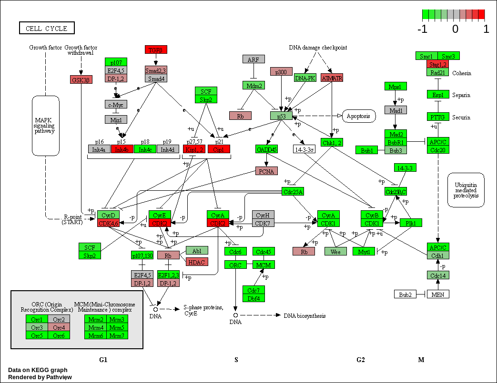
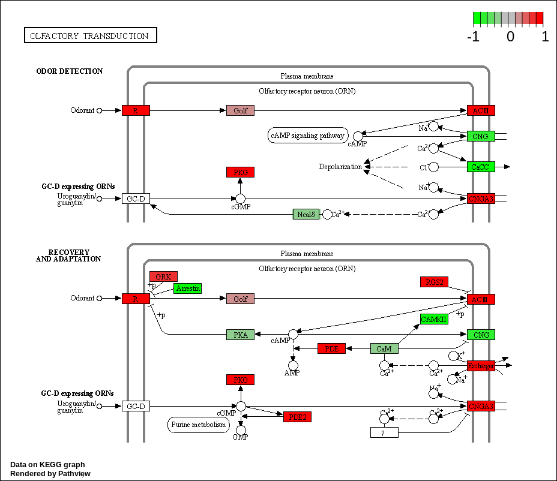
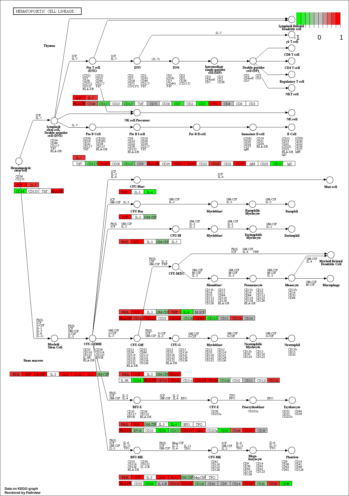
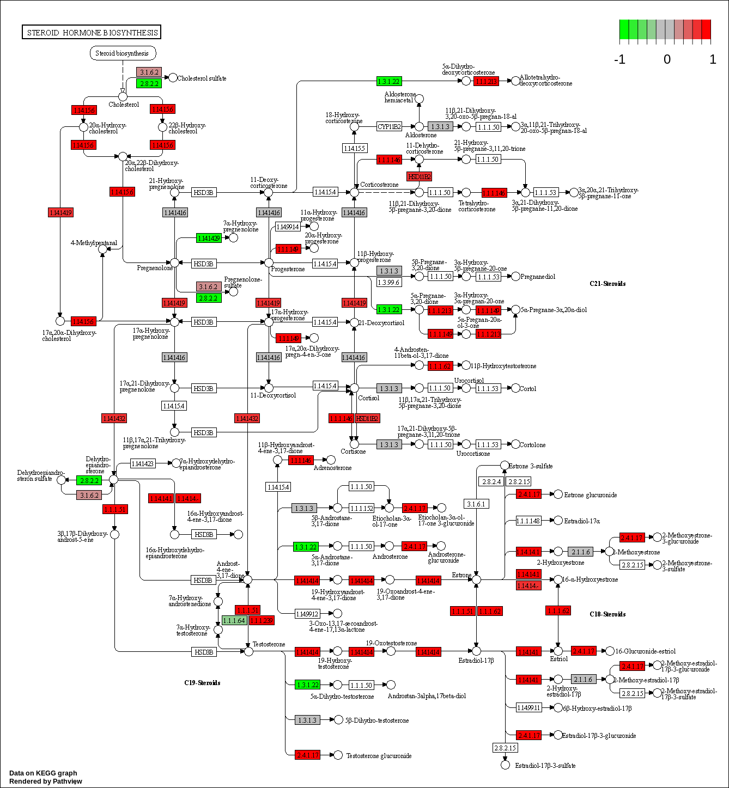
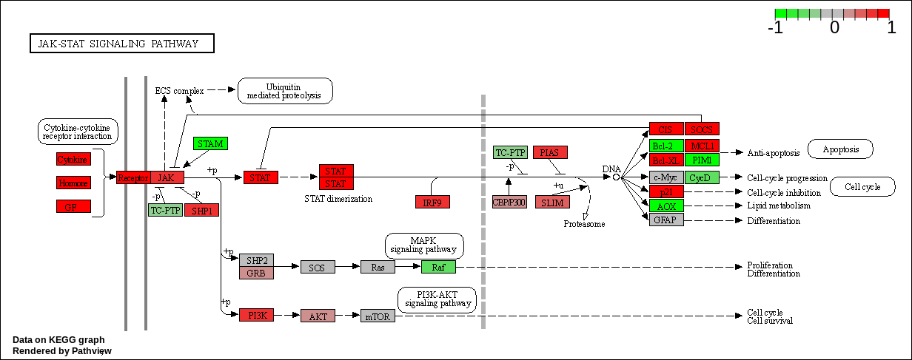
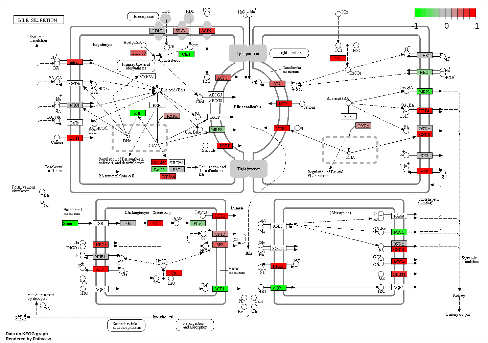
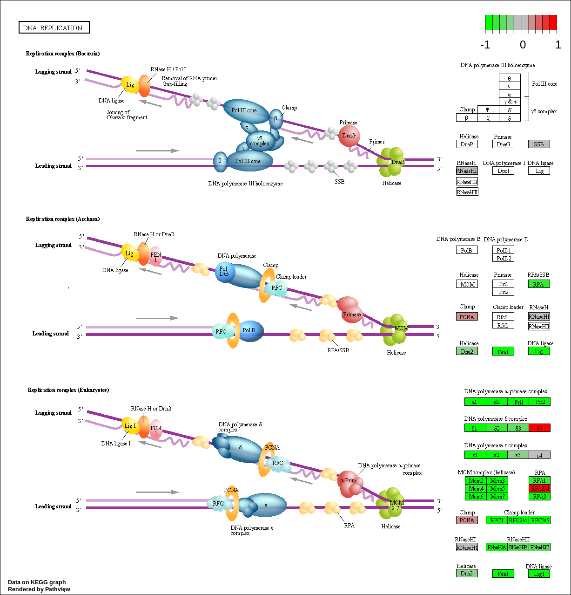
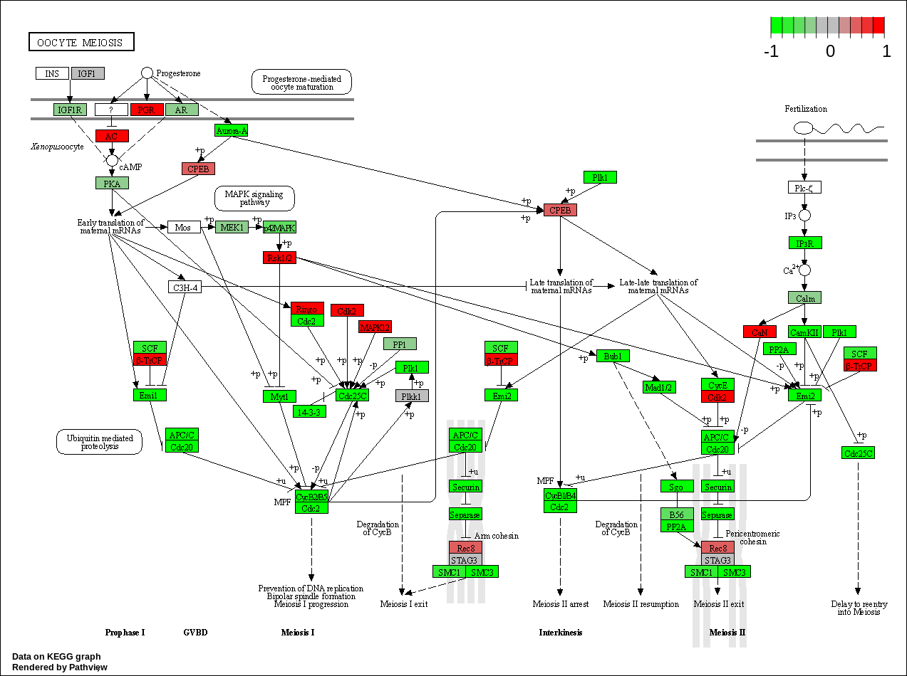

# Differential Expression Analysis

```{r}
library(DESeq2)
```
```{r}
# Load data files
metaFile <- "GSE37704_metadata.csv"
countFile <- "GSE37704_featurecounts.csv"
```
```{r}
# Import metadata and take a peak
colData = read.csv(metaFile, row.names=1)
head(colData)
```
```{r}
# Import countdata
countData = read.csv(countFile, row.names=1)
head(countData)
```

> Q1. Complete the code below to remove the troublesome first column from countData.

```{r}
# Note we need to remove the odd first $length col
# countData <- as.matrix(countData[,-1])
# head(countData)
```
 


> Q2. Complete the code below to filter countData to exclude genes (i.e. rows) where we have 0 read count across all samples (i.e. columns).


```{r}
# Filter count data where you have 0 read count across all samples.
countData2 = countData[rowSums(countData) > 0, ]
head(countData2)
```
Running DESeq2

```{r}
ncol(countData)
head(countData)
```

```{r}
dds = DESeqDataSetFromMatrix(countData=countData[,-1],
                             colData=colData,
                             design=~condition)
dds = DESeq(dds)
```
```{r}
dds
```
Get results for HoxA1 knockdown versus control siRNA
```{r}
res = results(dds, contrast=c("condition", "hoxa1_kd", "control_sirna"))
```

> Q3. Call the summary() function on your results to get a sense of how many genes are up or down-regulated at the default 0.1 p-value cutoff.

```{r}
summary(res, alpha = 0.1)
```

Volcano Plot

```{r}
plot( res$log2FoldChange, -log(res$padj) )
```
> Q4. Improve this plot by completing the below code, which adds color and axis labels.

```{r}
# Make a color vector for all genes
mycols <- rep("gray", nrow(res) )

# Color red the genes with absolute fold change above 2
mycols[ abs(res$log2FoldChange) > 2 ] <- "red"

# Color blue those with adjusted p-value less than 0.01
#  and absolute fold change more than 2
inds <- (res$padj < 0.01) & (abs(res$log2FoldChange) > 2 )
mycols[ inds ] <- "blue"

plot( res$log2FoldChange, -log(res$padj), col= mycols, xlab="Log2(FoldChange)", ylab="-Log(P-value)" )

```
PCA Plot

```{r}
pca <- prcomp(t(countData2))
```
```{r}
mycols2 <- rep(c("red","blue"), each=3)
mycols2
```

```{r}
plot(pca$x[,1:2], cols=mycols2, pch=16)
```

Adding gene annotation

> Q5. Use the mapIDs() function multiple times to add SYMBOL, ENTREZID and GENENAME annotation to our results by completing the code below.

```{r}
library("AnnotationDbi")
library("org.Hs.eg.db")
```

```{r}
columns(org.Hs.eg.db)
```

```{r}
res$symbol = mapIds(org.Hs.eg.db,
                    keys=row.names(res), 
                    keytype="ENSEMBL",
                    column="SYMBOL",
                    multiVals="first")

res$entrez = mapIds(org.Hs.eg.db,
                    keys=row.names(res),
                    keytype="ENSEMBL",
                    column="ENTREZID",
                    multiVals="first")

res$name =   mapIds(org.Hs.eg.db,
                    keys=row.names(res),
                    keytype="ENSEMBL",
                    column="GENENAME",
                    multiVals="first")

head(res, 10)
```

> Q6. Finally for this section let's reorder these results by adjusted p-value and save them to a CSV file in your current project directory.

```{r}
res = res[order(res$pvalue),]
write.csv(res, file="deseq_results.csv")
```

# Pathway Analysis
```{r}
library(pathview)
```
```{r}
library(gage)
library(gageData)
```
```{r}
data(kegg.sets.hs)
data(sigmet.idx.hs)
```
```{r}
# Focus on signaling and metabolic pathways only
kegg.sets.hs = kegg.sets.hs[sigmet.idx.hs]
```
```{r}
# Examine the first 3 pathways
head(kegg.sets.hs, 3)
```
Running gage pathway analysis
```{r}
foldchanges = res$log2FoldChange
names(foldchanges) = res$entrez
head(foldchanges)
```
```{r}
# Get the results
keggres = gage(foldchanges, gsets=kegg.sets.hs)
```
```{r}
attributes(keggres)
```

```{r}
# Look at the first few down (less) pathways
head(keggres$less)
```
Make a pathway plot with RNA-Seq expression results
```{r}
pathview(gene.data=foldchanges, pathway.id="hsa04110")
```

```{r}
# A different PDF based output of the same data
pathview(gene.data=foldchanges, pathway.id="hsa04110", kegg.native=FALSE)
```
```{r}
## Focus on top 5 upregulated pathways here for demo purposes only
keggrespathways <- rownames(keggres$greater)[1:5]

# Extract the 8 character long IDs part of each string
keggresids = substr(keggrespathways, start=1, stop=8)
keggresids
```
```{r}
pathview(gene.data=foldchanges, pathway.id=keggresids, species="hsa")
```





> Q7. Can you do the same procedure as above to plot the pathview figures for the top 5 down-reguled pathways?

```{r}
keggrespathwaysdown <- rownames(keggres$less)[1:5]
keggresidsdown = substr(keggrespathwaysdown, start=1, stop=8)
keggresidsdown
```

```{r}
pathview(gene.data=foldchanges, pathway.id=keggresidsdown, species="hsa")
```



# Gene Ontology (GO)
```{r}
data(go.sets.hs)
data(go.subs.hs)

# Focus on Biological Process subset of GO
gobpsets = go.sets.hs[go.subs.hs$BP]

gobpres = gage(foldchanges, gsets=gobpsets, same.dir=TRUE)

lapply(gobpres, head)
```

